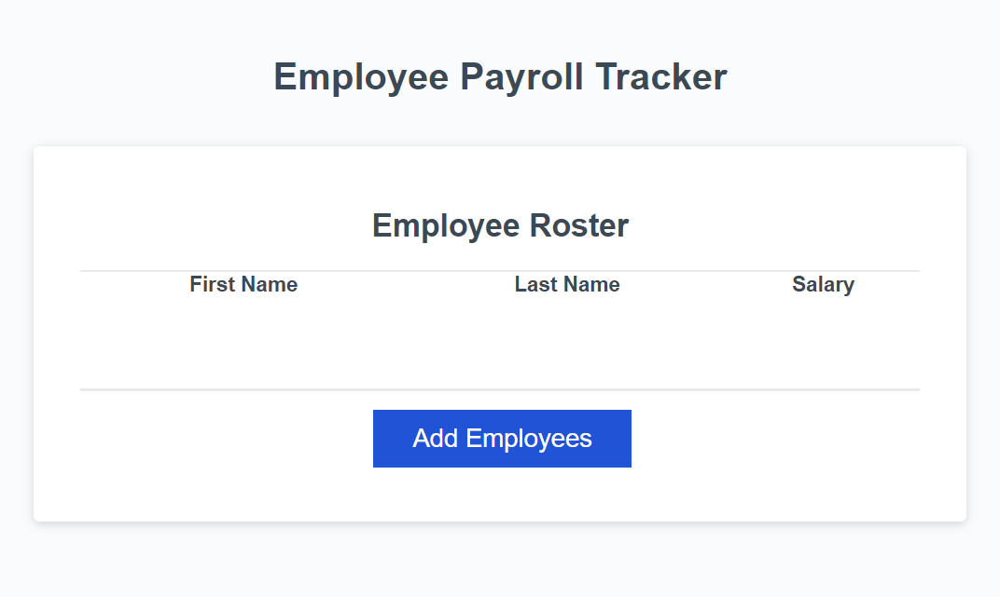

# Employee-Payroll-Tracker

## Description

This webpage is designed to allow a payroll manager to view employees' payroll data and properly budget for the company. It provides a way for a user to input employee information, see the inputted information in an organized table, as well as calculate related mathematical functions. Regarding the development process, it took more time than expected trying to digest the starter code, but the time spent understanding the existing code greatly helped me grasp the system as a whole and how the existing functions and the functions I included would translate into the final product.

## Usage

To open the Employee Payroll Tracker, click this link here to go directly!

[Employee Payroll Tracker](https://geovko.github.io/Employee-Payroll-Tracker//)

*OR* Copy this link to paste into a browser.
  ```md
https://geovko.github.io/Employee-Payroll-Tracker/
  ```


The Employee Payroll Tracker page has a blue button with the phrase 'Add Employees'. Once clicked, the page with prompt the user with four questions. The first will ask for the employee's first name. The second will ask for the employee's last name. The third will ask for the employee's salary. A numerical value must be inputted or else the salary section for this particular employee will be left as '$0.00'. The fourth questions will then prompt the user to answer whether or not they would like to continue. If the user chooses to continue, the user will then be prompted the same four questions but for the next employee. If the user chooses to cancel, a table will be displayer organizing the employees alphabetically by last name. In the console, an average of all of the employees will be provided and a random employee will chosen from the list of employees inputted.



## Credits

This project wouldn't have been completed without the aid of tutorials, assignments, and resources (regarding usage of certain methods, attributes, properties, etc.) provided by the UCI Bootcamp teaching staff. This project was also based off the starter code (i.e., the html, javaScript, and CSS files) which was provided by Xandromus.

## License

MIT License
